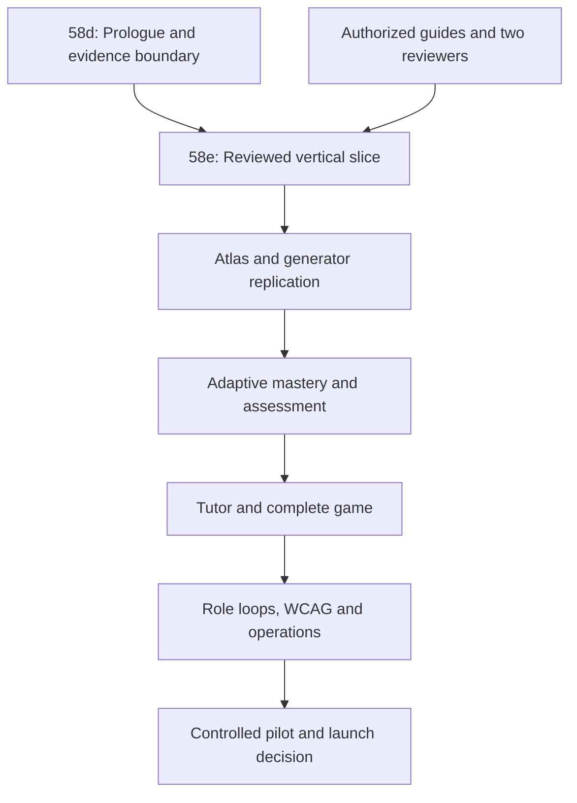

# Project Z Objective 100 Execution Plan

## Control statement

This plan is the dependency-ordered route from the verified live state on 15 July 2026 to objective launch completion. It is subordinate to the Product Constitution, IB Coverage Contract and 100% Acceptance Matrix. No phase count, route count, generated-question count or visual polish is a completion percentage.

**Project Z is not 100% complete until every acceptance gate is GREEN, production is reverified after the final release, and the controlled real-user pilot and launch decision are signed.**

## Authoritative targets and boundary

| Target | Identifier | Authority |
|---|---|---|
| GitHub | `ManoliMeletiou/project-z-meletiou-mathematics` | Writable source of truth |
| Vercel | `prj_lFXgmOQAiWASZkA0GDFaoWMzg0NH` / `project-z-meletiou-mathematics.vercel.app` | Writable Project Z deployment |
| Supabase | `jlesueqjdvmxkqaqmnke` | Writable Project Z database |
| Meletiou Mathematics and every other system | Any other identifier | Read-only reference; never mutate |

## Verified current truth — 15 July 2026

### Source, delivery and operations

- `main` was clean at commit `02a13db96549592e56f0fb8e69a09d2350c267cc`; there were zero open pull requests.
- Latest production deployment before Phase 58d was `dpl_24VhLeFNZbPU25pZSFq3PkcyMVnx`, READY, built from that commit.
- `/api/health` and `/` returned HTTP 200. The health version was `phase-58b-golden-generator-foundation`.
- Vercel showed no runtime errors in the audited seven-day window. The latest build completed successfully.
- The CI workflow exists and gates test, typecheck, build, smoke and Python compilation. The GitHub connector did not expose a latest `main` workflow run, so current-main CI visibility is an evidence gap until a Phase 58d PR run is captured.
- Production still exposes a broad prototype navigation surface. Calm progressive disclosure is therefore AMBER, not complete.

### Curriculum and mathematical content

- Exactly fourteen product pathways are registered: MYP Years 1–5 Standard and Extended; DP AA SL/HL and AI SL/HL.
- The atlas contains 438 legacy candidate placements: 142 MYP and 296 DP.
- Authorized guides registered: zero. Verified curriculum reviewers: zero. Approved skills: zero. Released pathways: zero.
- Phase 58b has one generator candidate, `number.place-value.round-order`, with five genuinely different families, 500 deterministic samples per family, 2,500 distinct instances, 2,500 independent answer checks, zero duplicates and digest `cfc6b83b2e6eee891fbe5110d5cadf16ffbf9ce232432f743cc0733ca4246b2f`.
- That skill and all pathways remain blocked pending authorized-source alignment and independent human mathematics review.
- MYP Criteria A–D and DP assessment boundaries are specified in contracts, but full reviewed teaching/assessment coverage is absent.

### Database and security

- Supabase was `ACTIVE_HEALTHY`, PostgreSQL 17.6.1.127 in `eu-west-1`.
- Before Phase 58d: 129 public tables, all with RLS enabled; 92 migrations; latest applied migration `20260713140118 phase_58b_golden_generator_foundation`.
- Representative live counts: 18 course-catalog rows, 14 pathway-evidence rows, 438 atlas candidates, 8 source records, 46 pathway-source records, 18 blueprints, 22 diagnostic questions, 1 diagnostic session, 12 diagnostic evidence rows, 1 mastery row, 1 practice attempt and 2 game profiles.
- Security advisors: 213 notices — 14 INFO sealed RLS tables without policies, 198 WARN authenticated security-definer execution paths, and leaked-password protection disabled. There were no ERROR/CRITICAL findings.
- Performance advisors: 400 notices — 111 unindexed foreign keys, 136 auth RLS init-plan findings, 97 multiple-permissive-policy findings, 55 unused indexes and one connection advisory.
- Database logs showed routine checkpoints and one connection reset; auth/API logs were empty in the inspected window.

### Highest-risk live discrepancies

1. The mandatory diagnostic prologue was enforced only in the browser. The database start RPC checked student role and course selection but not pathway release or diagnostic calibration.
2. Diagnostic submission accepted a question that had not been served by the session. Arbitrary/repeated submissions could create invalid evidence after release.
3. Correct answer and explanation were returned immediately, contaminating later adaptive evidence.
4. The answer-bearing diagnostic table had broad authenticated/anonymous table privileges even though RLS currently hid unreleased rows.
5. A client-callable XP RPC accepted a caller-selected amount and reason.
6. The legacy practice RPCs expect a Phase 13 practice-attempt shape, but the live table has a different Phase 3 shape. This schema collision means the claimed diagnostic-to-practice loop is not a valid vertical slice.
7. Quest/streak/studio RPCs pre-date the mandatory prologue and do not check a diagnostic unlock predicate.

Phase 58d is the first risk-reduction phase because no trustworthy vertical slice can be built while these evidence and unlock boundaries are client-controlled or structurally inconsistent.

### Reconciled live state after Phase 58e

- Phase 58d is merged and live; Phase 58e PR `#13` is merged at `8c06da797c2d06348ff6565bc6276248a010c328` with release-gate run `29415046847` passing.
- Project Z Supabase applied `20260715122514 phase_58e_vertical_slice_event_model`. The collided legacy row remains quarantined while new append-only teaching, delivery, attempt, correction, mastery, unlock and motivation-only reward ledgers are live and empty.
- Project Z Vercel production `dpl_F7ABP8zKyRTgPHQqntnexj1e1nr4` is READY; `/api/health` returns the Phase 58e version, `/recommended` remains signed-out protected, and build/runtime inspection is clean.
- Exactly fourteen pathways remain registered and unreleased. Authorized guides, verified curriculum reviewers, approved skills, approved teaching assets, approved generator families and released slice configs remain zero.
- The engineering foundation passes 58 Node contracts, typecheck, build, smoke, Python compilation, exact 2,500-instance generator reconciliation, CI and live migration assertions. This does not satisfy the reviewed Phase 58e gate.
- Owner-only blockers remain current authorized-guide access, a verified source mapper, a different qualified mathematics educator, approved diagnostic cases and representative authenticated accounts. All other work continues, but no curriculum release or completion claim is permitted without those dependencies.

## Dependency graph

Security, accessibility, operational and curriculum evidence work continues in parallel where it does not bypass the critical path.

## Execution phases and exit gates

### 0 — Truth and evidence hygiene

**Dependency:** none; remains continuous.

**Work**

- Reconcile `main`, PRs, CI, migrations, production deployment, health, logs, row counts and advisors at the start and end of every phase.
- Add a versioned phase evidence record with commit, PR, workflow runs, migration IDs, deployment ID, live checks, rollback and open risks.
- Treat missing evidence as not passed; never infer production truth from local success.

**Exit gate**

- Handover, phase report, acceptance matrix and live systems agree on the same commit/migrations/version.
- Every production claim has a reproducible query, test, URL or immutable review record.

**Tests/live evidence:** clean-tree check, migration ledger reconciliation, CI run URLs, Vercel deployment/health/log evidence, Supabase advisor/log evidence.

**Owner-only:** connector availability if an authoritative system cannot be inspected.

### 1 — Phase 58d: database-authoritative diagnostic prologue and main-game lock

**Dependency:** Phase 0 only. **Merged and verified live foundation.**

**Work**

- Store pathway/cohort/language/access preferences and two unscored tool-orientation checks.
- Require approved curriculum release plus separately approved diagnostic calibration before starting or serving.
- Create one server-issued outstanding item per session; accept one answer only for that item.
- Require answer, misconception, accessibility and independent human mathematics review before an item can be verified.
- Withhold correctness, solution and interim mastery until the diagnostic ends.
- Support pause/resume; return `inconclusive` instead of guessing when evidence is insufficient.
- Assign a first mission only from an approved atlas placement; keep the main game locked until sufficient evidence and that mission exist.
- Revoke answer-table access, client-awarded XP and pre-prologue quest surfaces. Quarantine the collided legacy practice RPCs.

**Exit gate**

- SQL migration passes a transaction/rollback dry run and production post-apply assertions.
- All fourteen pathway configs exist and remain `draft`; zero path or item is accidentally released.
- Unauthenticated and wrong-role access fails; arbitrary/replayed question submission fails; one outstanding delivery is enforced.
- Game/quest/studio cannot mutate or expose gameplay before the authoritative unlock predicate.
- CI, build, typecheck, production smoke and post-deploy health pass.

**Tests/live evidence:** property tests for every missing gate, SQL contract tests, authenticated RLS/RPC tests when fixtures exist, migration `20260715105711`, Phase 58d health checks, Vercel logs and smoke.

**Rollback:** fail closed by pausing sessions, revoking serving/game RPCs and reverting the Vercel app; preserve audit/evidence rows.

**Owner-only:** none to establish the locked foundation. Calibration approval itself requires representative reviewed cases and a qualified reviewer.

### 2 — Phase 58e: one complete reviewed vertical slice

**Dependencies:** Phase 58d plus legally usable current source evidence and two qualified reviewers.

**Scope:** `number.place-value.round-order` in the first school/product sequence approved by the curriculum workflow. Do not copy this pattern across the atlas before this slice passes.

**Work**

- Resolve the practice schema collision with a new immutable session/delivery/attempt/correction event model; do not retrofit incompatible columns ambiguously.
- Record exact authorized-source alignment, intended pathway/cohort, prerequisite edges and sequencing rationale.
- Obtain source-mapper approval and a different mathematics-educator approval for the placement and five generator families.
- Build diagnostic item set; explicit teaching; worked examples; scaffold ladder; independent practice; misconception-specific correction; retrieval/spaced review; mastery decision; first mission; checkpoint and unlock.
- Bind every generated instance to generator version, seed, skill, family, answer proof and review state.
- Award XP/rewards only from idempotent server-verified events and keep them separate from mastery/grades.
- Add calm student UI, teacher evidence/release view, parent-safe summary and operator rollback/monitoring.

**Measurable exit gate**

- At least 2,000 distinct reproducible instances remain independently verified; family balance and collision thresholds pass.
- 100% of reviewed samples are mathematically correct and aligned; zero unresolved severity-1/2 content defect.
- A student fixture completes diagnostic → teaching → guided practice → independent practice → feedback → correction → mastery → game unlock in a real browser.
- Replay, answer leakage, cross-role access, duplicate rewards and premature mastery/unlock tests all fail closed.
- At least one qualified reviewer signs the mathematics/content evidence and a different authorized mapper signs placement evidence.

**Live evidence:** immutable review IDs, generator digest, browser trace/video/screenshots, SQL event ledger, mastery explanation, first-mission assignment, CI and production smoke.

**Rollback:** disable the slice release flag, expire active deliveries, keep evidence, restore prior Vercel deployment.

**Owner-only:** current authorized IB guide access; verified source mapper; different qualified mathematics educator; representative test accounts.

**Current implementation status:** the collision-free event model, server-issued deterministic practice, teaching/correction/mastery rules, idempotent game/reward events, account export and calm first-mission UI are merged and live with 58 passing Node contracts, successful CI, production migration assertions and READY deployment evidence. The database serving generator reproduces the Phase 58b 2,500-instance digest. This is engineering evidence only: the slice remains blocked and this phase is not GREEN until the owner-only source/reviewer/calibration dependencies and authenticated reviewed browser/data proof are complete.

### 3 — Canonical prerequisite-linked atlas for all fourteen pathways

**Dependencies:** reviewed vertical-slice pattern and source/reviewer capacity.

**Work**

- Define atomic canonical skills once; map pathway/cohort placements without duplicating mathematical identity.
- Record every prerequisite edge, transitive-cycle check, diagnostic entry flag, teaching order and reviewed sequencing rationale.
- For flexible MYP ordering, document the reviewed school/product sequence separately from IB requirements.
- Keep MYP Years 1–5 Standard/Extended distinct. Keep DP AA/AI and SL/HL distinct, including cohort specification and DP’s own assessment model.
- Develop MYP Criteria A–D coverage with structured/teacher-judgement boundaries; never apply MYP criteria to DP.

**Exit gate**

- Every required skill/placement in all 14 pathways has current source provenance, two-person approval, prerequisites and sequence rationale.
- Zero orphan, duplicate-identity or prerequisite-cycle finding; 100% pathway coverage reconciles to authorized guides.
- Independent curriculum audit finds zero material omission or incorrect placement.

**Tests/live evidence:** graph validation, coverage diff by pathway/cohort, prerequisite property tests, immutable review log, independent audit sample and signed completeness decision.

**Rollback:** quarantine affected placements/pathways; no deletion of review history.

**Owner-only:** authorized guides, qualified reviewers, school sequencing decision where MYP is flexible.

### 4 — Verified practice depth across every active skill

**Dependencies:** approved atlas skill and Phase 58e generator/event pattern.

**Work**

- Design multiple meaningful families per skill, not cosmetic number substitution.
- Produce at least 2,000 reproducible distinct instances per active skill with fixed seed/version.
- Independently recompute answers; test units, symbolic equivalence, notation, domains, rounding, tolerances, distractors, accessibility and age appropriateness.
- Add stratified human review and release sampling. Quarantine any family whose defect/collision threshold fails.

**Exit gate**

- Every active skill meets the hard 2,000-distinct floor and all family/quality thresholds.
- Zero active skill relies on unverifiable free-form generation for correctness.
- Full-atlas digest, duplicate scan and independent-answer suite are reproducible in CI.

**Owner-only:** qualified mathematics reviewers and approved sampling standard.

### 5 — Diagnostic, mastery and spaced-learning validity

**Dependencies:** sufficient reviewed atlas breadth and verified diagnostic/practice items.

**Work**

- Calibrate routing, stopping, confidence, inconclusive handling and prerequisite diagnosis against teacher-reviewed learner cases.
- Separate observations, inferences, confidence and formal assessment.
- Validate mastery thresholds, decay/retrieval schedule, correction effects and transfer tasks.
- Add cohort/pathway differential checks and fairness/accessibility analysis.

**Exit gate**

- Predeclared accuracy/calibration thresholds pass on held-out reviewed cases.
- Explainability reconstructs every starting map, recommendation and mastery change from immutable evidence.
- No single response can create mastery or unlock; inconclusive cases remain locked and receive a safe next step.

**Owner-only:** approved validation protocol, qualified reviewers, representative de-identified/consented cases.

### 6 — Correct assessment models for MYP and DP

**Dependencies:** atlas and learning evidence validity.

**Work**

- Fully develop MYP Criteria A–D tasks, rubrics, evidence collection and teacher judgement.
- Implement DP AA/AI SL/HL course- and cohort-correct assessment structures without reusing MYP criteria.
- Keep auto-markable evidence, structured rubric support and teacher-only judgement explicit.

**Exit gate**

- Independent reviewers sign every pathway/cohort assessment model.
- Criterion/assessment coverage matrix has no gap; marking-agreement target passes; AI never finalizes protected teacher judgement.

**Owner-only:** applicable authorized curriculum/assessment guides and qualified IB mathematics reviewers.

### 7 — Teaching AI tutor and learning companion

**Dependencies:** approved content, misconception maps and mastery model.

**Work**

- Implement teach → elicit reasoning → diagnose misconception → scaffold → check → fade support.
- Prevent answer dumping, assessment cheating, unsafe/private disclosures and dependence-promoting behavior.
- Ground tutor actions in released skill evidence; log source, policy, scaffold level and learning outcome.
- Make the companion calm, optional/reduced-motion safe and focused on independence.

**Exit gate**

- Safety/red-team suite, answer-leakage suite and role/privacy tests pass.
- Teacher-reviewed misconception and scaffold accuracy meets predeclared threshold.
- Controlled evaluation shows learning gain and support fading; no claim is made from engagement alone.

**Owner-only:** AI safety policy/legal decisions, teacher-reviewed evaluation set, provider budget limits.

### 8 — Complete game architecture

**Dependencies:** verified learning/reward events and first-mission slice.

**Work**

- Implement universes, worlds, regions, stages, missions, checkpoints, bosses, side quests, achievements and companion progression as data-driven structures.
- Require learning prerequisites and server-known events for unlocks; make rewards idempotent and auditable.
- Separate XP/cosmetics/streaks from grades, mastery evidence and IB assessment reporting.

**Exit gate**

- Every game node has a released learning objective and unlock rule; zero dead end or bypass path.
- Replay/concurrency tests cannot duplicate rewards. Reduced-motion/non-game alternatives provide equivalent learning access.

**Owner-only:** final narrative/art direction and child-safety review of reward design.

### 9 — Complete student, teacher, parent and operator workflows

**Dependencies:** stable vertical slice and role security.

**Work**

- Student: prologue, mission, teaching, practice, correction, review, progress and help.
- Teacher: class/roster, diagnostic insight, adaptation, generate/audit/publish, feedback/corrections, assessment and reporting.
- Parent: verified child link, released progress, home support prompts and privacy-safe explanations.
- Operator: reviewer identity, release/quarantine, audit, support, deletion/export, monitoring and incident controls.

**Exit gate**

- Real-browser happy, empty, error, retry, slow-network and denial paths pass for every role.
- Cross-role/property-based isolation tests show zero unauthorized row or RPC access.

**Owner-only:** realistic test accounts and school workflow decisions.

### 10 — WCAG 2.2 AA, child safety, privacy and security closure

**Dependencies:** stable critical workflows; begins earlier and repeats here in full.

**Work**

- Keyboard, focus, semantics, screen reader, contrast, zoom/reflow, target size, errors, reduced motion and alternative-to-3D checks.
- Minimize child data; finalize consent, retention, export/deletion, moderation, safeguarding and breach decisions.
- Reduce authenticated security-definer allow-list, repair RLS/advisor issues by risk, enable leaked-password protection and approved MFA policy.

**Exit gate**

- WCAG 2.2 AA audit has zero open A/AA blocker across role-critical flows.
- No high/critical security issue; role matrix and penetration tests pass; owner approves legal/privacy/safeguarding documents.

**Owner-only:** legal/privacy/safeguarding approvals, leaked-password dashboard switch, MFA and retention decisions.

### 11 — Reliability, performance and operations

**Dependencies:** release-candidate workflows.

**Work**

- Add structured monitoring, uptime/latency/error/cost alerts, abuse/rate limits, provider fallbacks and support queues.
- Test backup, point-in-time recovery/restore, migration rollback, Vercel rollback and AI/provider outage.
- Resolve unindexed FKs, RLS init plans and duplicate policies based on measured risk/benefit.

**Exit gate**

- SLOs and budgets pass under agreed load; alert-to-diagnosis drill passes.
- Backup restore and rollback drills meet RPO/RTO; operator runbooks reproduce the result.

**Owner-only:** SLO/RPO/RTO and cost-budget decisions; production incident participants.

### 12 — Controlled pilot and launch decision

**Dependencies:** every non-pilot acceptance gate GREEN.

**Work**

- Pre-register pilot cohort, consent, success/stop criteria, support and defect severity.
- Run representative students, teachers and parents through complete live workflows.
- Correct and re-test all blockers; freeze schema/release candidate; re-run full evidence matrix.

**Exit gate**

- Signed pilot evidence meets predeclared learning, usability, safety, reliability and role-isolation criteria with zero release blocker.
- Every acceptance-matrix row is GREEN; final main commit, migrations, deployment, rollback and limitations are recorded.
- Owner signs the launch decision. Only then may Project Z be called `100% complete` for the defined launch scope.

**Owner-only:** real consented pilot participants, school/guardian coordination and signed launch decision.

## Owner-only dependency ledger

| Dependency | Blocks | What engineering can continue meanwhile |
|---|---|---|
| Legally permitted current authorized IB guide access | Exact curriculum approval | Evidence schema, graph tooling, generator framework, security, UX, tests |
| Verified source mapper | Placement approval | Candidate preparation and automated consistency checks |
| Different qualified mathematics educator | Skill/family approval | Automated answer/duplicate/notation/unit proofs |
| Reviewed calibration cases | Diagnostic release | Locked engine, item delivery, explainability and inconclusive behavior |
| Privacy/legal/safeguarding decisions | Compliance GREEN | Data minimization, access controls, export/deletion tests, draft runbooks |
| Leaked-password/MFA dashboard decisions | Identity GREEN | Automated auth/role fixtures and remaining least-privilege work |
| Representative role accounts | Browser/RLS evidence | Unit, property, SQL-contract and unauthenticated tests |
| Consented pilot participants | Pilot/100% claim | Every preceding gate |

## Release discipline

For every phase:

1. Start from live `main`; record baseline commit, PRs, CI, Vercel and Supabase truth.
2. Make Project Z-only changes on a branch and migration; do not weaken a gate.
3. Run local tests and a transactional migration dry run.
4. Open a PR, capture CI and preview evidence, then apply the production migration in dependency-safe order.
5. Merge only when gates pass; verify main deployment, health, logs, database assertions and advisors.
6. Record rollback, known limitations, owner-only dependencies and exact next actions.
7. Update `PROJECT_Z_CURRENT_HANDOVER.md`, the phase handover/report and acceptance matrix to the merged live state.

If implementation and evidence disagree, the lower-confidence status governs. A phase is not complete until the handover matches production.
